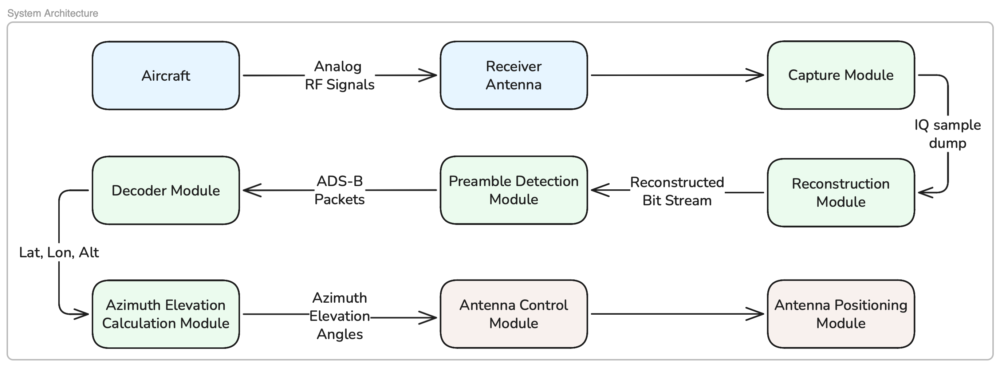
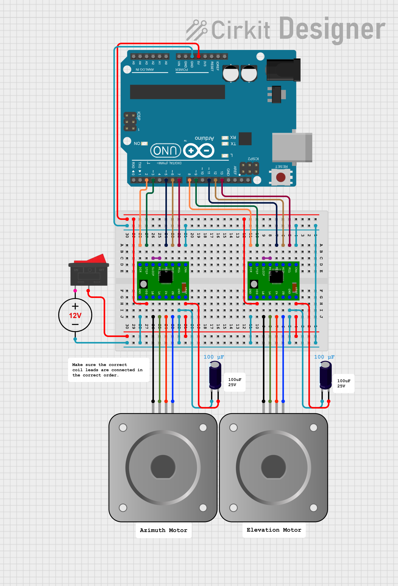

# ADS-B Aircraft Tracking with RTL-SDR

A real-time dual axis aircraft tracking system based on ADS–B signals using RTL-SDR, custom Mode S decoding, and Arduino-based antenna positioning.

## Features

- **Antenna Tracking**: Real-time calculation of Azimuth and Elevation to point an antenna at a target aircraft.
- **Data Capture**: High-speed IQ sample capture (2 MHz) centered at 1090 MHz using `librtlsdr`.
- **Decoding**: Custom implementation for Mode S preamble detection and message decoding.
- **Integration**: Modular design with `position_provider`, `antenna_controller`, and `decoder_module`.
- **Visualization**: Generate plots for aircraft position, altitude, azimuth, elevation, and range.

## Prerequisites

### Platform Support

| Platform | Support         |
| -------- | --------------- |
| Linux    | Fully supported |
| macOS    | Partial support |
| Windows  | Not supported   |

> **Note**: All development and testing was done on Ubuntu Linux. The decoder, az/el pipeline, and visualisation scripts are platform-independent. Only `launcher.sh` and `rtlsdr_rec_pipeline.cpp` are Linux-specific.

### Hardware
- RTL-SDR Dongle (e.g., RTL-SDR Blog V3/V4)
- Antenna optimized for 1090 MHz (ADS-B frequency)
- Microcontroller (Arduino Uno)
- Motors and motor drivers for azimuth and elevation control
- Pan/Tilt Antenna Mount (for tracking)

### Software
- **C++ Compiler**: `g++` or `clang`
- **librtlsdr**: Driver library for RTL-SDR
- **Python 3.x**: Core logic and controller.

```bash
# System
sudo apt install g++ librtlsdr-dev

# Python
pip3 install pymap3d pyserial matplotlib numpy --user
```

## Project Structure
```
ADS-B-based-aircraft-tracking-using-RTL-SDR/
├── scripts/
│   └── launcher.sh                          # Script to start the full live pipeline 
└── src/
    ├── capture_module/
    │   └── rtlsdr_rec_pipeline.cpp          # C++ RTL-SDR IQ capture
    ├── decoder_module/
    │   └── adsb_decoder_pipeline.py         # ADS-B decoder
    ├── azel_module/
    │   └── azel_pipeline.py                 # Az/El computation + Arduino serial
    └── visualisation/
        ├── azel_live_plot.py                # Live azimuth/elevation view with altitude and range plots
        ├── visualise_decoder_comparison.py  # Decoder csv output vs pyModeS comparison
        └── plot_ADSB_data.py                # IQ signal visualizer
├── arduino/
│   └── antenna_tracker.ino                  # Code for arduino
```

## System Pipeline

RTL-SDR → IQ Capture → ADS-B Decoder → Position Extraction → Azimuth/Elevation Calculation → Arduino → Pan/Tilt Motors

<p align="center">
  
</p>

## Circuit Diagram

<p align="center">
  
</p>


## Installation

1. **Clone the repository**

2. **Compile the Recorder**:
   Ensure you have the `librtlsdr` headers and library available.

   ```bash
    g++ src/capture_module/rtlsdr_rec_pipeline.cpp \
    -o rtlsdr_rec_pipeline -lrtlsdr
   ```

## Usage

### Live Tracking

> **Linux only** — launcher.sh requires Bash and Unix FIFOs.
> Minor changes are needed to use on MacOS. Windows is not supported without rewrite.

1. Connect RTL-SDR dongle and antenna
2. Connect Arduino via USB
3. Run from project root:

```bash
./scripts/launcher.sh .csv
```

4. Optionally open live plot in a second terminal:

```bash
python3 src/visualisation/azel_live_plot.py
```

5. System auto-exits after 90 seconds or press **Ctrl+C** to stop before

### Decode an Existing Capture

```bash
python3 -m src.decoder_module.adsb_decoder_pipeline \
    --file captures/iq_samples_XXXXXXXX.bin .csv
```

### Standalone Motor Test (no RTL-SDR needed)

```bash
python3 src/azel_module/azel_pipeline.py
```

## Configuration

### Ground Station Coordinates
Edit in `src/decoder_module/adsb_decoder_pipeline.py`:
```python
RECEIVER_LAT = 8.5000   # your latitude
RECEIVER_LON = 76.9000  # your longitude
```

Edit in `src/azel_module/azel_pipeline.py`:
```python
gs_lat = 8.5000   # your latitude
gs_lon = 76.9000  # your longitude
```

### Capture Duration
Edit in `src/capture_module/rtlsdr_rec_pipeline.cpp`:
```cpp
#define CAPTURE_DURATION_SEC  90   // seconds
```

### Arduino Serial Port
Edit in `src/azel_module/azel_pipeline.py`:
```python
ARDUINO_PORT = '/dev/ttyUSB0'              # Linux
```

## Arduino

Upload `antenna_tracker.ino` to Arduino Uno before running.


## Contributors

- [@userpran](https://github.com/userpran)
- [@avantika-adiyodi](https://github.com/avantika-adiyodi)
- [@nandithavinodnair894-cpu](https://github.com/nandithavinodnair894-cpu)
- [@hanismohd](https://github.com/hanismohd)
